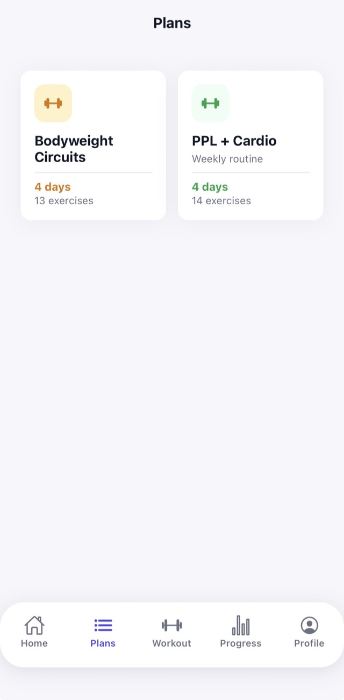
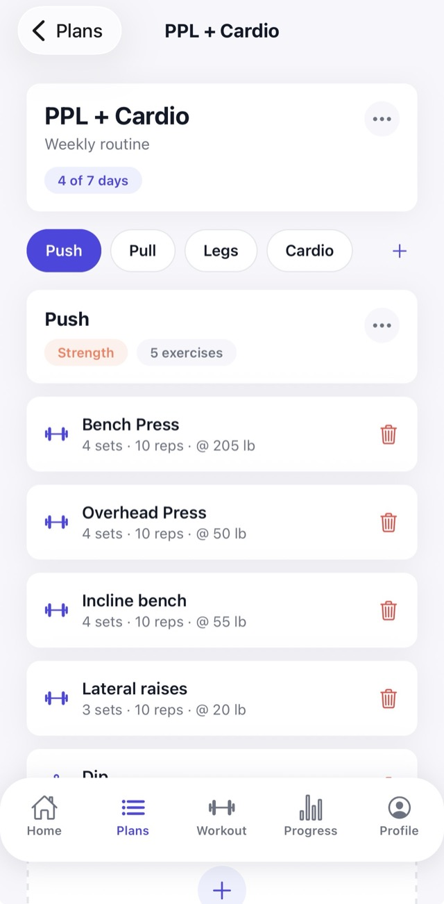
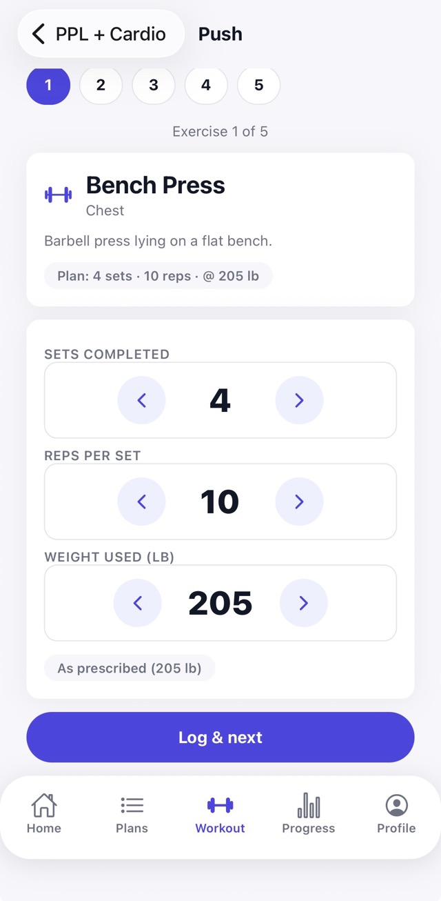
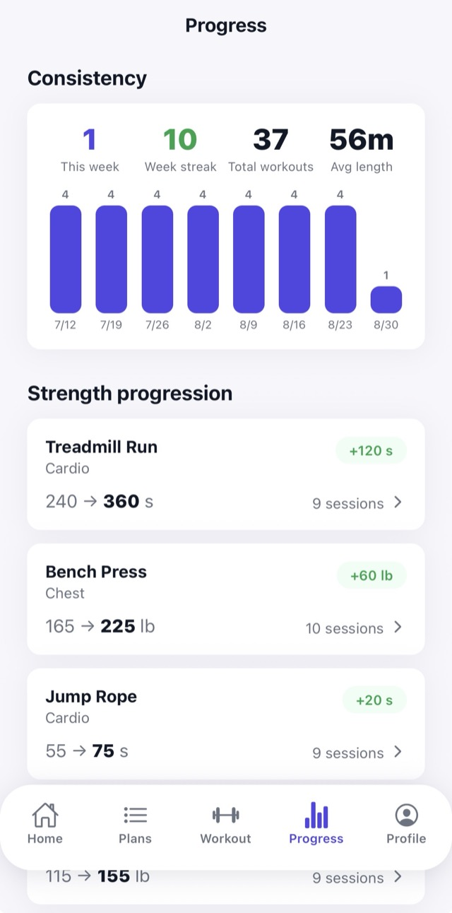

# Exemplar Fitness

[](https://github.com/BrodyMouw/exemplar-fitness-app/actions/workflows/ci.yml)

A workout planning and training-log app: build a weekly plan, run through it one exercise at a time, and track strength progression over time.

Built as a full-stack project — React Native (Expo) client, ASP.NET Core API, PostgreSQL, hosted authentication.

<p align="center">
  
  
  
  
</p>

<p align="center">
  <sub>Plans · Plan detail · Guided workout runner · Progress</sub>
</p>

---

## Stack

| Layer | Technology |
|---|---|
| Mobile | React Native 0.81 / Expo SDK 54, TypeScript (strict), React Navigation 7 |
| API | ASP.NET Core (.NET 10), Entity Framework Core 10 |
| Database | PostgreSQL 16 (Docker Compose) |
| Auth | Clerk — email/password + Google OAuth, JWT bearer validation |

---

## What it does

**Plans → Routines → Exercises.** A plan covers one training week and holds up to seven routines (one per training day). Each routine prescribes exercises drawn from a shared catalog, with sets and either reps-and-weight or a timed hold.

**Guided workout runner.** Pick a plan and a day, then work through it one exercise at a time — a progress strip to jump between exercises, a countdown timer for timed holds, and an at-a-glance indicator of whether you went heavier or lighter than the plan called for.

**Progress tracking.** Training consistency (weekly volume, streaks, average session length), per-exercise progression with tap-through history charts, and body-weight tracking.

**Exercise catalog.** 18 seeded exercises plus your own private additions, each with a mode (reps or time) and resistance type (added weight or bodyweight) that drives which fields the UI collects.

**Preferences.** Kilograms or pounds, applied everywhere weights are shown or entered.

---

## Architecture notes

The decisions below were the interesting ones — most of them are about protecting data rather than adding features.

### Training history outlives the plan that produced it

A workout log records the **catalog exercise** it was for (`WorkoutLog.ExerciseId`), not just the plan-specific prescription it was logged against. Deleting a plan you've stopped following nulls the back-link and leaves the history intact.

This was a deliberate correction. `WorkoutLogs` originally had *no* foreign keys at all, so deleting a routine silently orphaned its logs — and because the stats reached the catalog by joining *through* the prescription, that history quietly disappeared from the progress screen rather than failing loudly. The table now carries three constraints with intentionally different delete behaviour:

| Column | References | On delete | Why |
|---|---|---|---|
| `UserId` | `Users` | Cascade | Deleting an account clears its data |
| `ExerciseId` | `Exercises` | Restrict | The catalog is shared; a used exercise can't be removed |
| `RoutineExerciseId` | `RoutineExercises` | Set null | The plan can go — the log stays |

### Per-user archiving, not a shared flag

Exercises can be hidden from your picker. Because seeded exercises are shared across all users, archive state lives in a `(UserId, ExerciseId)` join table rather than an `IsArchived` column on `Exercises` — a boolean would have compiled fine, tested identically for a single user, and hidden a shared exercise from *everyone*.

Since logged history holds `RESTRICT` references to exercises, archiving is also the only coherent removal story: a used exercise genuinely cannot be deleted, so hiding works *with* the constraints instead of failing against them.

### Units are a display concern

Every weight is stored in kilograms, always. The kg/lb preference converts at the display boundary and back on input, so the stored value is never ambiguous — a `70` logged last month means the same thing regardless of what the preference was that day, and toggling units can't corrupt data. Component state stays canonical; conversion happens only at the input widget's boundary.

The per-exercise unit is metric-aware: progression on a barbell lift is tracked in weight, on a bodyweight movement in reps, and on a plank in seconds — so only the weight-metric values are ever converted.

### Sessions are recorded, not inferred

A "workout" used to be *derived* — a distinct (date, routine) pair reconstructed from log timestamps — which couldn't distinguish two sessions of the same routine in a day or produce a duration.

`WorkoutSession` makes it a recorded fact. Starting a workout is **idempotent**: re-entering a routine you're partway through resumes the open session rather than forking a second one, and returns its existing logs so the runner restores your checkmarks and entered values instead of double-logging. Sessions left open from a previous day auto-close.

### Duration is derived, not stored

The mirror image of the decision above. `Routine` carried an
`EstimatedTimeMinutes` column, which is derived data wearing a fact's clothing:
it moves when an exercise is added, when a prescription is edited, and every
time the routine is trained. Three separate things would have had to remember
to invalidate it, and it would have been quietly wrong in between. The column
is gone; the estimate is computed per request.

It prefers measurement over guesswork — the median of your own completed
sessions for that routine, falling back to a prescription-based estimate
(work, rest between sets, changeover) until there are at least three.

Both numbers there are deliberate. **Median, not mean**, because a session you
tapped through in a minute is real, recorded data and a terrible predictor: one
routine with nine sessions at ~65 minutes also has a 1-minute run-through, and
the mean reports 59 where the median reports 65. **Three sessions**, because
that is the smallest sample in which a single outlier cannot *be* the median —
at one it is the answer, at two it drags the midpoint halfway.

The API returns which source it used, and the UI says so rather than dressing a
guess as a measurement: "Typical for your last 9 sessions" against
"Estimated from the plan".

### Migrations that carry data forward

Two migrations needed hand-editing rather than accepting the generated scaffold:

- Adding `ExerciseId` to existing logs — EF generates it as `NOT NULL DEFAULT '00000000-...'`, which would point every historical row at a non-existent exercise. Rewritten as add-nullable → backfill from the prescription → tighten, so a failed backfill errors loudly instead of admitting bad data.
- Introducing sessions — existing logs are grouped using the same rule the old derived stats used, so the totals already on screen don't move. The session id is computed as `md5(user || routine || date)::uuid` so both the insert and the follow-up update derive the identical key and correlate without a temporary column.

### A failed request is not an empty account

Every screen fetched with `.then(setState)` and no rejection handling, so an
unreachable API left state at its initial value and the screen rendered its
empty state — "No plans yet", "0 workouts, no streak", "No history for this
exercise yet". The app reported, confidently and in its own voice, that data
the user had entered did not exist.

Reads now go through a `useLoad` hook that keeps the failure and offers a
retry, and the two outcomes render differently on purpose: `ErrorState` when
nothing loaded, `ErrorBanner` when a *refresh* failed over data already on
screen — that data is real, just possibly stale, so discarding it would lose
more than it explains. Writes go through `attempt`, because a rejected save
previously just stopped: the sheet stayed open, the button re-enabled, and
nothing said the change hadn't landed.

The distinction that has to survive is "the server answered" versus "we never
reached it". `ExerciseHistoryScreen` shows why: the history endpoint returns
404 for an exercise with no logs, so *that* 404 is a real answer — but the
screen was catching every failure and reporting all of them as "no history
yet". Only 404 is treated as data now; the unit tests pin the two apart.

### Authentication

Clerk owns sign-up and credentials. The API validates JWTs against Clerk's JWKS endpoint and never handles passwords. A middleware provisions a local `User` row from the token's claims on first authenticated request, so the database has something to hang foreign keys off without duplicating identity management.

---

## Running locally

**Prerequisites:** .NET 10 SDK, Node 20+, Docker, a [Clerk](https://clerk.com) application.

```bash
docker compose up -d
```

Configure the API — add your Clerk Frontend API URL to `api/appsettings.Development.json`:

```json
{
  "ConnectionStrings": {
    "Default": "Host=localhost;Port=5432;Database=fitnessdb;Username=fitnessapp;Password=devpassword"
  },
  "Clerk": { "Authority": "https://<your-app>.clerk.accounts.dev" }
}
```

```bash
cd api
dotnet ef database update
dotnet run --launch-profile http
```

Configure the client — copy `mobile/.env.example` to `mobile/.env` and fill it in:

```
EXPO_PUBLIC_CLERK_PUBLISHABLE_KEY=pk_test_...
EXPO_PUBLIC_API_BASE=http://192.168.1.42:5002
```

`EXPO_PUBLIC_API_BASE` needs your machine's LAN IP for a physical device (the API binds to `0.0.0.0` so the device can reach it), or `http://10.0.2.2:5002` on the Android emulator.

```bash
cd mobile
npm install
npx expo start
```

## Tests

```bash
dotnet test          # API — 35 tests
cd mobile && npm test  # conversion + error mapping — 18 tests
```

API tests run against a real PostgreSQL database (`fitnessdb_test`, created automatically on the same container) rather than EF's in-memory provider. That's deliberate: several of the guarantees under test — logged history surviving a deleted plan, the catalog resisting deletion while referenced — exist purely as foreign-key delete behaviour, and the in-memory provider doesn't enforce foreign keys at all, so those tests would pass whether or not the design actually worked.

Controllers are exercised directly with a synthetic `ClaimsPrincipal` rather than through the HTTP stack, since the logic under test is in the controller. Every endpoint is user-scoped, so each test creating its own user id gives isolation without teardown.

Coverage is aimed at the non-obvious logic rather than line count: ownership enforcement, the durable-history invariant, stats aggregation (week bucketing, streak breaks, per-mode metric selection), and session resume idempotency.

Both suites run in GitHub Actions on every push to `main` and every pull request, with Postgres as a service container. The test connection string comes from `FITNESS_TEST_DB` when set and falls back to the local development container, so `dotnet test` needs no configuration locally.

---

## Project layout

```
api/
  Controllers/     REST endpoints, all authorized and user-scoped
  Models/          EF Core entities
  Data/            DbContext, relationship config, catalog seed
  Middleware/      Clerk JWT → local user provisioning
  Migrations/      Schema history, including hand-written data backfills
mobile/
  screens/         One file per screen
  components/      Shared design system + composed components
  navigation/      Tab navigator and per-tab stacks
  api/             Typed API client and response types
  theme.ts         Palette, spacing, typography tokens
  units.ts         kg/lb conversion boundary
```

---

## Roadmap

Deliberately deferred, in rough priority:

- **Per-set variance** — a log currently summarizes all sets, so a dropped final set is indistinguishable from a clean one
- **Drag-to-reorder** exercises within a routine
- **Sharing plans between users** — the private-exercise ownership model is the prerequisite
- **Broader test coverage** — the suite currently targets the highest-risk logic; the screens themselves are untested
- **HTTPS and Sign in with Apple** before this goes near real users
